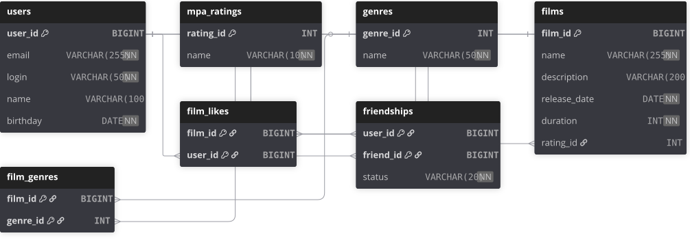

# java-filmorate

Бэкенд-сервис для рекомендаций фильмов. Пользователи могут оценивать фильмы, добавлять друзей и получать рекомендации на основе предпочтений.

## Функциональность

- CRUD-операции для фильмов и пользователей
- Добавление и удаление лайков к фильмам
- Добавление в друзья и подтверждение дружбы
- Вывод списка общих друзей
- Рекомендации фильмов на основе лайков друзей
- Вывод топ-N популярных фильмов

## Стек технологий

- Java
- Spring Boot
- Maven
- JDBC
- H2 Database
- Lombok
- REST API

## Структура проекта

src/main/java/filmorate/
├── controller/    # REST-контроллеры
├── model/         # Модели данных (Film, User)
├── service/       # Бизнес-логика
├── storage/       # Хранение данных (InMemory, Database)
├── exception/     # Обработка ошибок
└── validator/     # Валидация входных данных

